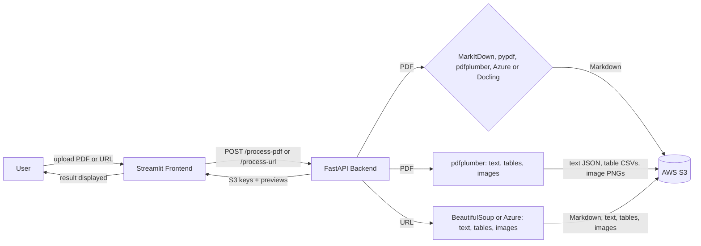

# Unstructured Data Ingestion Pipeline

A pipeline that converts unstructured documents (PDFs and web pages) into clean Markdown and stores the results in AWS S3. It also saves the text, each table and each image as separate files. It includes a FastAPI backend and a Streamlit UI, plus a comparison of extraction tools (open-source libraries, Docling/MarkItDown, and enterprise document services).

**Live app:** https://unstructured-data-ingestion-pipeline-agwzsbtb3xtfdvpuc9d7k6.streamlit.app/
**Backend API:** https://ingestion-pipeline-api.onrender.com

> The backend runs on Render's free tier and sleeps after about 15 minutes without requests. Open the backend link first and give it a minute or two to wake up.

## What it does

1. Upload a PDF or submit a web page URL through the Streamlit app.
2. Pick a tool and the FastAPI backend converts it to Markdown. The app has six tools:

   | Tool | PDF tab | URL tab | Notes |
   |---|---|---|---|
   | MarkItDown | yes | yes | Fast, runs on Render |
   | pypdf | yes | PDF links | Text only; tables come from pdfplumber |
   | pdfplumber | yes | PDF links | Text and tables |
   | Azure Document Intelligence | yes | yes | Needs Azure keys; free tier reads 2 pages per request, so the backend sends the PDF in 2-page chunks (up to 12 pages) |
   | Docling (open source) | yes | PDF links | Open-source tool that needs a lot of memory, so it works only when the project is run locally, not on the Render free tier |
   | BeautifulSoup | | yes | Web pages |

   A URL that points to a PDF is handled like an uploaded PDF.
3. It also extracts the parts separately:
   - **Text** as a JSON file
   - **Tables**, each saved as its own CSV file
   - **Images**, each saved as its own PNG, including figures drawn as vector graphics (detected from their "Figure N:" captions)
4. Tables are written as Markdown tables. Each image link is placed in the Markdown at the position of the picture, above its "Figure N" caption. Any image that cannot be placed is listed in an **Extracted images** section at the end.
5. Everything is uploaded to S3 with metadata tags (source, tool, date, type). The app shows the S3 locations, a preview of each table and a Markdown preview, and lets you download the Markdown.

## Architecture



How the pieces fit together:

- **Extraction:** pdfplumber pulls the text, tables and images out of a PDF, and BeautifulSoup does the same for a web page. Enterprise services (Azure Document Intelligence, AWS Textract) were run separately for comparison.
- **Standardization:** the tool chosen in the app (MarkItDown, pypdf, pdfplumber, Azure or Docling) converts a PDF into one Markdown file, with tables as Markdown tables and image links at the figures.
- **Storage:** every output is uploaded to a private, encrypted S3 bucket under a fixed folder layout, with metadata tags.
- **API:** FastAPI exposes `/process-pdf` and `/process-url`, runs the steps above, and returns the S3 locations and a preview.
- **Front end:** Streamlit sends the upload or URL to the API and shows the results.

## Project structure

```
app.py                         Streamlit frontend (Upload PDF / Submit URL tabs, tool dropdown)
api/main.py                    FastAPI backend (/process-pdf, /process-url)
extract_pdf.py                 Task 1: open-source PDF extraction (pypdf, pdfplumber)
extract_web.py                 Task 1: open-source web scraping (requests, BeautifulSoup)
extract_azure.py               Task 2: Azure Document Intelligence on the PDFs
extract_azure_web.py           Task 2: Azure Document Intelligence on the web pages
extract_textract.py            Task 2: AWS Textract script (needs a paid AWS plan)
convert_markdown.py            Task 3/4: batch PDF-to-Markdown conversion with Docling + MarkItDown
upload_to_s3.py                Task 5: batch upload of raw files, Markdown, and images to S3
docs/comparison.md             Task 3: open-source vs Docling/MarkItDown vs enterprise comparison
docs/docling_vs_markitdown_vs_Open_Source_Lib.md   Task 4: Docling vs MarkItDown vs open-source libraries
docs/s3_storage_layout.md      Task 5: S3 bucket naming scheme and metadata strategy
data/pdfs/                     Sample test PDFs (ACE, LSC, graph-CNN)
```

## Setup

### Prerequisites

- Python 3.10 or newer
- Git
- An AWS account with an S3 bucket and an IAM user that can read and write to it
- Optional: an Azure Document Intelligence resource (for the Azure option in the app and for `extract_azure.py` and `extract_azure_web.py`)

### 1. Clone the repo

```
git clone https://github.com/sarahk15-king/unstructured-data-ingestion-pipeline.git
cd unstructured-data-ingestion-pipeline
```

### 2. Create a virtual environment and install dependencies

```
python -m venv venv
venv\Scripts\activate          # Windows
source venv/bin/activate       # macOS / Linux
pip install -r requirements.txt
```

To use Docling in the app, install the local requirements instead (they add `docling`):

```
pip install -r requirements-local.txt
```

### 3. Set environment variables

Create a `.env` file in the project root. Never commit it.

```
AWS_ACCESS_KEY_ID=...
AWS_SECRET_ACCESS_KEY=...
AWS_REGION=...
S3_BUCKET=...
```

Only for Azure (the app's Azure option and the Azure scripts):

```
AZURE_DOCINTEL_ENDPOINT=...
AZURE_DOCINTEL_KEY=...
```

### 4. Run it locally

Backend:

```
uvicorn api.main:app --reload
```

Frontend, in a second terminal:

```
streamlit run app.py
```

To use the app against your local backend, set `API_URL` to `http://localhost:8000` (`API_URL=http://localhost:8000 streamlit run app.py`). Docling is only available when the backend runs locally.

### 5. Run the individual tasks (optional)

```
python extract_pdf.py
python extract_web.py
python extract_azure.py
python extract_azure_web.py
python extract_textract.py
python convert_markdown.py
python upload_to_s3.py
```

## Deploying

### Backend on Render

1. Push the repo to GitHub. Never commit `.env` or any keys.
2. In Render, create a new **Web Service** and connect the GitHub repo.
3. Build command: `pip install -r requirements.txt`
4. Start command: `uvicorn api.main:app --host 0.0.0.0 --port $PORT`
5. Under **Environment**, add `AWS_ACCESS_KEY_ID`, `AWS_SECRET_ACCESS_KEY`, `AWS_REGION` and `S3_BUCKET`. To use the Azure option, also add `AZURE_DOCINTEL_ENDPOINT` and `AZURE_DOCINTEL_KEY`.
6. Deploy and wait until the service shows **Live**. Open the service URL to check that it returns `{"status": "ok"}`.

### Frontend on Streamlit Community Cloud

1. Set `API_URL` in `app.py` to your Render URL and push the change.
2. At share.streamlit.io, create a new app from the GitHub repo with `app.py` as the main file.
3. Deploy. Streamlit redeploys automatically on every push to GitHub.

### Updating a deployed app

Commit the change to GitHub. Render and Streamlit both redeploy on their own.

## Tool comparison summary

Three approaches were tested on PDF and web extraction:

- **Open-source (pypdf, pdfplumber, BeautifulSoup):** free and light, and the fastest, but they return plain text and need custom code for structure, tables and figures. pdfplumber missed all tables in one PDF and hit a limit on another.
- **Docling / MarkItDown:** Docling preserved structure and tables faithfully but was slow (195s on a 19-page table-heavy PDF). MarkItDown was near-instant but lost word spacing and mangled tables and formulas on complex documents.
- **Enterprise (Azure Document Intelligence, AWS Textract):** Azure's free tier handled text cleanly but found zero tables and hit file-size limits. It analyzes only the first two pages of each document on the free tier. AWS Textract could not be tested because it requires upgrading the AWS free plan to a paid plan.

**Recommendation:** Docling for dense, multimodal PDFs; MarkItDown as a fast fallback for simple text documents. Full write-ups are in `docs/comparison.md` and `docs/docling_vs_markitdown_vs_Open_Source_Lib.md`.

## S3 storage layout

```
raw/pdf/<source>/<date>/<file>.pdf
raw/web/<document>/<date>/text.json
raw/web/<document>/<date>/tables/table_<n>.csv
processed/markdown/<tool>/<source>/<file>.md
processed/extracted/pdf/<document>/text.json
processed/extracted/pdf/<document>/tables/page<p>_table<n>.csv
assets/images/<source>/<document>/<image>.png
```

Every object carries metadata tags (source, tool, date, type, document name) so files can be filtered without parsing key paths. The bucket is private, blocks public access and uses SSE-S3 encryption. Full detail in `docs/s3_storage_layout.md`.

## Known limitations

- **Docling works only locally.** Docling is an open-source tool that loads heavy AI models. Render's free tier has 512 MB of memory, so it runs out of memory there and returns a 502 error. To use Docling, run the project on your own computer: install `requirements-local.txt`, start the backend with `uvicorn api.main:app --reload`, and run the app with `API_URL=http://localhost:8000 streamlit run app.py`. The other five tools work on the live app.
- Azure's free tier reads only 2 pages per request, so the backend sends the PDF in 2-page chunks and stops at 12 pages.
- The image links in the Markdown are `s3://` links to the private bucket, so a Markdown viewer will not show them as pictures. Pictures without a "Figure N" caption are placed at the end of their page for pypdf and pdfplumber, and at the end of the file for the other tools. Images from web pages are listed at the end.
- Complex tables with merged cells may not become clean Markdown tables.

## Tech stack

FastAPI, Streamlit, boto3 (AWS S3), Docling, MarkItDown, pdfplumber, pypdf, BeautifulSoup, Azure AI Document Intelligence, AWS Textract. Backend deployed on Render, frontend on Streamlit Community Cloud.
