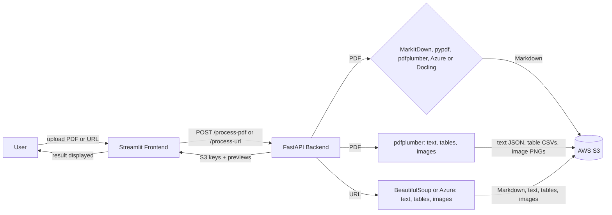

# Unstructured Data Ingestion Pipeline

A pipeline that converts unstructured documents (PDFs and web pages) into clean Markdown and stores the results in AWS S3. It also saves the text, each table and each image as separate files. It includes a FastAPI backend and a Streamlit UI, plus a comparison of extraction tools (open-source libraries, Docling/MarkItDown, and enterprise document services).

**Live app:** https://unstructured-data-ingestion-pipeline-agwzsbtb3xtfdvpuc9d7k6.streamlit.app/
**Backend API:** https://ingestion-pipeline-api.onrender.com

> The backend runs on Render's free tier and sleeps after about 15 minutes without requests. Open the backend link first and give it a minute or two to wake up.

## What it does

1. Upload a PDF or submit a web page URL through the Streamlit app.
2. Pick a tool and the FastAPI backend converts it to Markdown. The app has six tools:

   | Tool | PDF tab | URL tab | Notes |
   |---|---|---|---|
   | MarkItDown | yes | | Fast, runs on Render |
   | pypdf | yes | PDF links | Text only; tables come from pdfplumber |
   | pdfplumber | yes | PDF links | Text and tables |
   | Azure Document Intelligence | yes | yes | Needs Azure keys; free tier reads 2 pages per request, so the backend sends the PDF in 2-page chunks (up to 12 pages) |
   | Docling | yes | PDF links | Needs a lot of memory, so it works when the backend runs locally |
   | BeautifulSoup | | yes | Web pages |

   A URL that points to a PDF is handled like an uploaded PDF.
3. It also extracts the parts separately:
   - **Text** as a JSON file
   - **Tables**, each saved as its own CSV file
   - **Images**, each saved as its own PNG, including figures drawn as vector graphics (detected from their "Figure N:" captions)
4. Tables are written as Markdown tables. Each image link is placed in the Markdown at the position of the picture, above its "Figure N" caption. Any image that cannot be placed is listed in an **Extracted images** section at the end.
5. Everything is uploaded to S3 with metadata tags (source, tool, date, type). The app shows the S3 locations, a preview of each table and a Markdown preview, and lets you download the Markdown.

## Architecture

How the pieces fit together:

- **Extraction:** pdfplumber pulls the text, tables and images out of a PDF, and BeautifulSoup does the same for a web page. Enterprise services (Azure Document Intelligence, AWS Textract) were run separately for comparison.
- **Standardization:** the tool chosen in the app (MarkItDown,
