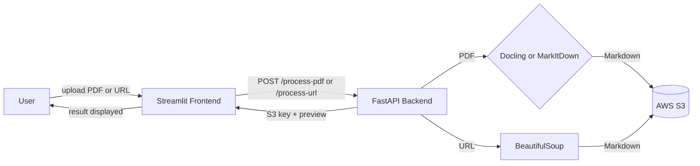

# Unstructured Data Ingestion Pipeline

A pipeline that converts unstructured documents (PDFs and web pages) into clean Markdown and stores the results in AWS S3. Includes a FastAPI backend and a Streamlit UI for interactive use, plus a comparison of extraction tools (open-source, Docling/MarkItDown, and enterprise OCR services).

**Live app:** https://unstructured-data-ingestion-pipeline-agwzsbtb3xtfdvpuc9d7k6.streamlit.app/
**Backend API:** https://ingestion-pipeline-api.onrender.com

## What it does

1. Upload a PDF or submit a web page URL through the Streamlit app.
2. The FastAPI backend converts it to Markdown (via Docling or MarkItDown for PDFs, BeautifulSoup for web pages).
3. The result is uploaded to S3 with metadata tags (source, tool, date, type).

## Project structure
app.py                      Streamlit frontend (Upload PDF / Submit URL tabs)
api/main.py                 FastAPI backend (/process-pdf, /process-url)
extract_pdf.py              Task 1: open-source PDF extraction (pypdf, pdfplumber)
extract_web.py              Task 1: open-source web scraping (requests, BeautifulSoup)
extract_azure.py            Task 2: enterprise extraction via Azure Document Intelligence
extract_textract.py         Task 2: enterprise extraction via AWS Textract
convert_markdown.py         Task 3/4: batch PDF-to-Markdown conversion with Docling + MarkItDown
upload_to_s3.py             Task 5: batch upload of raw files, Markdown, and images to S3
docs/comparison.md          Task 3: open-source vs Docling/MarkItDown vs enterprise comparison
docs/docling_vs_markitdown.md  Task 4: head-to-head Docling vs MarkItDown comparison
docs/s3_storage_layout.md   Task 5: S3 bucket naming scheme and metadata strategy
data/pdfs/                  Sample test PDFs (ACE, LSC, graph-CNN)

# Running Locally
Backend:
pip install -r requirements.txt
uvicorn api.main:app --reload

Frontend:
streamlit run app.py

Requires a .env file with:
AWS_ACCESS_KEY_ID=...
AWS_SECRET_ACCESS_KEY=...
AWS_REGION=...
S3_BUCKET=...

If running the frontend aganist a local backend, update API_URL in app.py to http://localhost:8000

# Tool comparison summary
Three approaches were tested on PDF and web extraction:

# Open-source (pypdf, pdfplumber, BeautifulSoup): 
free and dependency-light, but required custom handling for tables and images, and failed outright on one dense PDF.
# Docling / MarkItDown: 
Docling preserved structure and tables faithfully but was slow (195s on a 19-page table-heavy PDF); MarkItDown was near-instant but lost word spacing and mangled tables/formulas on complex documents.
# Enterprise (Azure Document Intelligence, AWS Textract): 
Azure's free tier handled text cleanly but found zero tables and hit file-size limits; AWS Textract could not be fully tested due to account activation issues.

# Recommendation: 
Docling for dense, multimodal PDFs; MarkItDown as a fast fallback for simple text documents. Full writeups in docs/comparison.md and docs/docling_vs_markitdown.md.

# S3 storage layout
raw/pdf/<source>/<date>/<file>.pdf
raw/web/<document>/<date>/<text|tables>.json
processed/markdown/<tool>/<source>/<file>.md
assets/images/<source>/<document>/<image>

Every object carries metadata tags (source, tool, date, type, document name) for filtering without parsing key paths. Full detail in docs/s3_storage_layout.md.

# Tech stack

FastAPI, Streamlit, boto3 (AWS S3), Docling, MarkItDown, BeautifulSoup, Azure AI Document Intelligence, AWS Textract. Backend deployed on Render, frontend on Streamlit Community Cloud.

## Architecture

