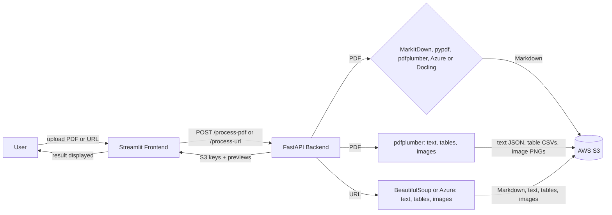

# Unstructured Data Ingestion Pipeline

A pipeline that converts unstructured documents (PDFs and web pages) into clean Markdown and stores the results in AWS S3. It also saves the text, each table and each image as separate files. It includes a FastAPI backend and a Streamlit UI, plus a comparison of extraction tools (open-source libraries, Docling/MarkItDown, and enterprise document services).

**Live app:** https://unstructured-data-ingestion-pipeline-agwzsbtb3xtfdvpuc9d7k6.streamlit.app/
**Backend API:** https://ingestion-pipeline-api.onrender.com

> The backend runs on Render's free tier and sleeps after about 15 minutes without requests. Open the backend link first and give it a minute or two to wake up.

## What it does

1. Upload a PDF or submit a web page URL through the Streamlit app.
2. Pick a tool and the FastAPI backend converts it to Markdown. The app has six tools:

   | Tool | PDF tab | URL tab | Notes |
   |---|---|---|---|
   | MarkItDown | yes | | Fast, runs on Render |
   | pypdf | yes | PDF links | Text only; tables come from pdfplumber |
   | pdfplumber | yes | PDF links | Text and tables |
   | Azure Document Intelligence | yes | yes | Needs Azure keys; free tier reads 2 pages per request, so the backend sends the PDF in 2-page chunks (up to 12 pages) |
   | Docling (open source) | yes | PDF links | Open-source tool that needs a lot of memory, so it works only when the project is run locally, not on the Render free tier |
   | BeautifulSoup | | yes | Web pages |

   A URL that points to a PDF is handled like an uploaded PDF.
3. It also extracts the parts separately:
   - **Text** as a JSON file
   - **Tables**, each saved as its own CSV file
   - **Images**, each saved as its own PNG, including figures drawn as vector graphics (detected from their "Figure N:" captions)
4. Tables are written as Markdown tables. Each image link is placed in the Markdown at the position of the picture, above its "Figure N" caption. Any image that cannot be placed is listed in an **Extracted images** section at the end.
5. Everything is uploaded to S3 with metadata tags (source, tool, date, type). The app shows the S3 locations, a preview of each table and a Markdown preview, and lets you download the Markdown.

## Architecture



How the pieces fit together:

- **Extraction:** pdfplumber pulls the text, tables and images out of a PDF, and BeautifulSoup does the same for a web page. Enterprise services (Azure Document Intelligence, AWS Textract) were run separately for comparison.
- **Standardization:** the tool chosen in the app (MarkItDown, pypdf, pdfplumber, Azure or Docling) converts a PDF into one Markdown file, with tables as Markdown tables and image links at the figures.
- **Storage:** every output is uploaded to a private, encrypted S3 bucket under a fixed folder layout, with metadata tags.
- **API:** FastAPI exposes `/process-pdf` and `/process-url`, runs the steps above, and returns the S3 locations and a preview.
- **Front end:** Streamlit sends the upload or URL to the API and shows the results.

## Project structure

```
app.py                         Streamlit frontend (Upload PDF / Submit URL tabs, tool dropdown)
api/main.py                    FastAPI backend (/process-pdf, /process-url)
extract_pdf.py                 Task 1: open-source PDF extraction (pypdf, pdfplumber)
extract_web.py                 Task 1: open-source web scraping (requests, BeautifulSoup)
extract_azure.py               Task 2: Azure Document Intelligence on the PDFs
extract_azure_web.py           Task 2: Azure Document Intelligence on the web pages
extract_textract.py            Task 2: AWS Textract script (needs a paid AWS plan)
convert_markdown.py            Task 3/4: batch PDF-to-Markdown conversion with Docling + MarkItDown
upload_to_s3.py                Task 5: batch upload of raw files, Markdown, and images to S3
docs/comparison.md             Task 3: open-source vs Docling/MarkItDown vs enterprise comparison
docs/docling_vs_markitdown_vs_Open_Source_Lib.md   Task 4: Docling vs MarkItDown vs open-source libraries
docs/s3_storage_layout.md      Task 5: S3 bucket naming scheme and metadata strategy
data/pdfs/                     Sample test PDFs (ACE, LSC, graph-CNN)
```

## Setup

### Prerequisites

- Python 3.10 or newer
- Git
- An AWS account with an S3 bucket and an IAM user that can read and write to it
- Optional: an Azure Document Intelligence resource (for the Azure option in the app and for `extract_azure.py` and `extract_azure_web.py`)

### 1. Clone the repo

```
git clone https://github.com/sarahk15-king/unstructured-data-ingestion-pipeline.git
cd unstructured-data-ingestion-pipeline
```

### 2. Create a virtual environment and install dependencies

```
python -m venv venv
venv\Scripts\activate          # Windows
source venv/bin/activate       # macOS / Linux
pip install -r requirements.txt
```
